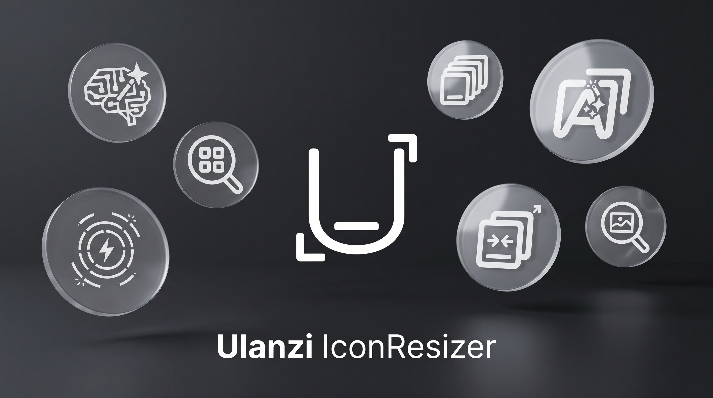

[](https://ulanzicommunitystore.narlei.com)

<!-- Banner -->
<p align="center">
  
</p>

<h1 align="center">Ulanzi IconResizer</h1>

<p align="center">
  <b>The all-in-one icon studio for the Ulanzi Deck.</b><br>
  Resize photos, search icons & images, generate text/animated icons, use AI, and build whole packs — in one plugin.
</p>

<p align="center">
  
  
  
  
  
</p>

---

## ✨ Overview

**Ulanzi IconResizer** turns any picture, keyword, emoji or idea into a perfectly
sized button icon for your Ulanzi Deck. It ships **seven** independent actions,
each with a live preview and a polished, accessible interface. Everything is
**DPI-independent** (works on 1080p and 4K laptops alike) and fully localized
into **9 languages**.

Output resolutions:
- **Standard** — `196 × 196`
- **Clock** — `458 × 196` (wide keys)

---

## 🧩 Features (7 actions)

| Action | What it does |
|--------|--------------|
| 🖼️ **Resizer Icons** | Drop or pick a photo, then drag/zoom in the cropper to frame it. WYSIWYG preview, fills the button cleanly. Saves PNG. |
| 🔍 **Search Icons** | Search the **Iconify** open-icon index. Pick a vector icon, recolor it, set background, resize, done. |
| 🌅 **Search Images** | Search stock photos (**Pixabay**). Thumbnails and downloads are proxied so they load even where the CDN is blocked. |
| 🔤 **IconText Generate** | Turn text into an icon: 16 fonts, gradient text & background, shadow, border, alignment, and **16 color themes**. Live render. |
| 🎬 **Animated Generator** | Generate animated **GIF** icons with **15 effects** (pulse, spin, marquee, blink, rainbow, shake, bounce, wave, swing, zoom, fade, slide, glitch, heartbeat, neon) and **16 presets**. |
| 🤖 **AI Generator** | Chat-style icon creation. Generate with **Google Gemini** (your own key) or pull free images from the **Image Bank** (Pixabay). |
| 📦 **Batch Pack** | Build a whole pack of matching buttons at once — shared font/colors/theme, per-button emoji or searched icon, single-strip preview. |

### Highlights
- **Any-language search** — type in Portuguese, Chinese, Korean, etc.; the query is auto-translated to English so you get the right results.
- **Live preview everywhere** — fonts, sizes, colors, effects and framing update in real time.
- **Cropper parity** — what you frame in the adjust screen is exactly what gets saved.
- **Silver-shimmer UI** with accessible labels and hint chips (double-click to adjust, drag/zoom hints).
- **4K-safe** export pipeline (rect-based, DPI-independent).

---

## 🌍 Languages

English · Português · Español · Français · Deutsch · 中文 (简体) · 中文 (繁體) · 日本語 · 한국어

The UI auto-detects the Ulanzi/system language and falls back to English.

---

## 💾 Installation

### From the Ulanzi Store
Search for **IconResizer** in the UlanziDeck plugin store and click install.

### From Ulanzi Community Store

Download here: https://ulanzicommunitystore.narlei.com/plugins/?plugin=JEAN-ALMEIDA-CZO/Ulanzi-IconResizer-Plugin

### Manual / from source
1. Clone or download this repository.
2. Run `npm install` (installs the single dependency, `ws`).
3. Copy the folder `com.ulanzi.iconresizer.ulanziPlugin` into:
   - **Windows:** `%AppData%\Roaming\Ulanzi\UlanziDeck\Plugins\`
   - **macOS:** `~/Library/Application Support/Ulanzi/UlanziDeck/Plugins/`
4. Restart **UlanziDeck Studio**.

> Requires UlanziDeck software **2.1.0+**.

---

## 🚀 Usage

1. Drag one of the seven **IconResizer** actions onto a key.
2. The property-inspector panel opens — pick a photo/icon, type text, choose an effect, or start an AI chat.
3. Adjust with the live preview (double-click the preview to open the cropper).
4. Click **Generate / Process** — the icon is saved to your Ulanzi icon library and applied to the key.

Generated files are written to:
- **Windows:** `%AppData%\Roaming\Ulanzi\UlanziDeck\Icons\IconResizer*`
- **macOS:** `~/Library/Application Support/Ulanzi/UlanziDeck/Icons/IconResizer*`

---

## 🔑 AI Generator setup (optional)

The **AI Generator** can use Google Gemini. You provide **your own** free API key:
1. Get a key at <https://ai.google.dev>.
2. Open the AI action → settings (gear) → paste the key → save.
3. The key is stored locally and only sent to Google's API. The **Image Bank**
   mode needs no key.

---

## 🛠️ Tech & compatibility

- **Cross-platform:** path handling via `os.platform()` + `path.join` (Windows + macOS).
- **No native binaries** — pure-JS dependency (`ws`), portable everywhere.
- **Local save service** runs on a random loopback port (`127.0.0.1`), with a WebSocket SDK fallback.
- **Debug logging** is off by default; enable with the env var `ICONRESIZER_DEBUG=1`.

---

## 📦 Project structure

```
com.ulanzi.iconresizer.ulanziPlugin/
├── manifest.json            # 7 actions, OS = windows + mac
├── plugin/app.js            # backend: SDK + local save service
├── property-inspector/      # one HTML panel per action
├── libs/                    # Ulanzi SDK, gif.js, gifsicle, css
├── resources/               # action icons (svg + png)
├── <lang>.json              # 9 localization files
├── LICENSE
└── THIRD-PARTY-LICENSES.md
```

---

## 📄 License

Released under the **MIT License** — see [LICENSE](com.ulanzi.iconresizer.ulanziPlugin/LICENSE).
Bundled libraries and online services are credited in 
[THIRD-PARTY-LICENSES.md](com.ulanzi.iconresizer.ulanziPlugin/THIRD-PARTY-LICENSES.md).

---

<p align="center">
  Made by <b>Jean Almeida</b> for the Ulanzi Deck community.
</p>
